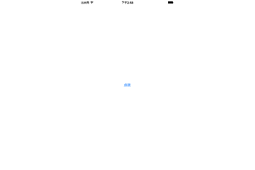

# AlertView


一个自定义的AertView,带有block方便事件处理 



##使用方法

将方法设置到单例里面  

``` 

/**
*  自定义弹出框
说明1:如没有点击事件处理,空实现即可,视图可自己消失
说明2:可在方法内部指定位置设置参数
*
*  @param aView       弹框添加的视图
*  @param type        弹框的类型
*  @param image       弹框上的的图片
*  @param title       弹框标题
*  @param message     弹框内容
*  @param leftString  左侧button标题 (如果只有一个按钮填nil)
*  @param rightString 右侧button标题 (如果只有一个按钮填按钮的标题)
*  @param okBlock     确定执行事件 (空实现点击界面即可消失)
*  @param canleBlock  取消执行事件 (空实现点击界面即可消失)
*/
- (void)addAlertViewToView:(UIView *)aView
type:(AlertViewType)type
image:(UIImage *)image
title:(NSString *)title
message:(NSString *)message
leftButtonTitle:(NSString *)leftString
rightButtonTitle:(NSString *)rightString
okButton:(okBlock)okBlock
canleButton:(canleBlock)canleBlock;

``` 

可以设置枚举定义样式

``` 
typedef NS_ENUM(NSInteger, AlertViewType)
{
AlertViewTypeSuccess,//一个点击按钮
AlertViewTypeSelect//两个点击按钮
};
``` 

最后调用方法：  


##安装

###CocoaPods Installation
在Podfile中加入：  

``` 
pod 'KZWAlertView'
``` 

###Manual Installation

将KZWAlertView文件夹拖拽到你的工程

